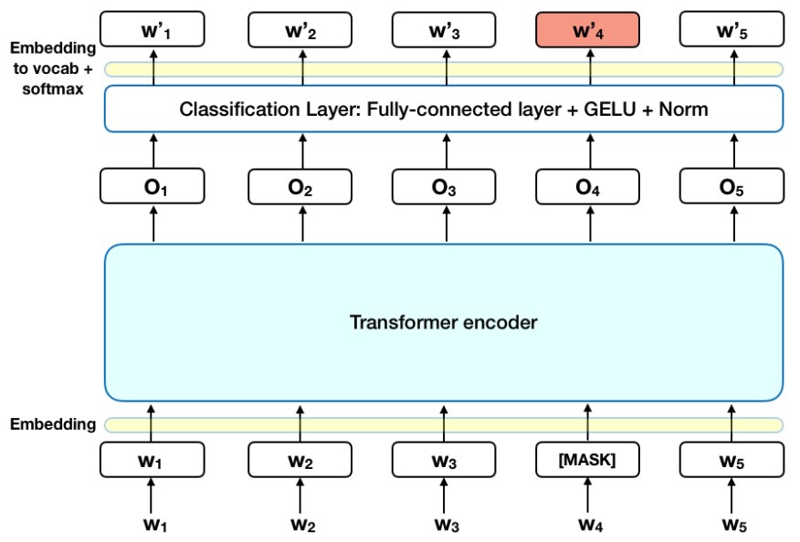
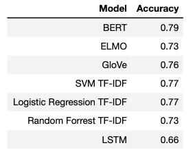
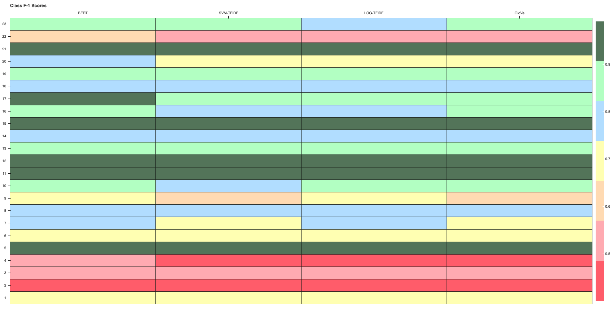
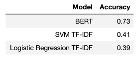

# Article Classification with Transfer learning 

## Introduction
Transfer learning in NLP has been activated via word and more recently context-aware word representations. These representations (aka embeddings) are a key tool in making transfer learning available to downstream NLP tasks (entailment, classification etc.). [ELMo](https://arxiv.org/abs/1802.05365) uses bidirectional LSTMs trained on a language modeling objective, apart from performance, it promises a major reduction in the training data required to achieve state of the art results. 

A sequence of works appeared in rapid succession this summer, one of them being GPT from Radford et al. both matching or surpassing ELMo by using transformers in place of bi-lstms. Both models share a common feature, that is language modeling. Language modeling focuses on the goal of generating the next element (word in NLP case) in a sequence (sentence). **BERT** does something different. 

[BERT](https://arxiv.org/abs/1810.04805) uses *masked language modeling*. Words in a sequence are replaced. Each word has a probability of being replaced by a <MASK> token. Then these masked words are asked to be predicted by the Transformer. This gives BERT leverage that both aforementioned models did not have. The bidirectional LSTMs are handicapped in the sense that they are limited to two directions (left or right). They cannot take advantage of contexts both left and right, whereas BERT can. 



This repo contains data where one data record is an article. There are 23 different article types (23 different classes) and over 92000 articles. Each article is associated with only one class. This repo contains the code for getting predictions from various models. These models are;

 

| Models         | Transfer Learning|
| -------------- |:-------------:| 
| BERT           | yes | 
| ELMo           | yes      |   
| GloVe embedding layer LSTM   | yes      |     
|rbf SVM TFIDF |no|
|Logistic Regression TFIDF|no|
|Random Forrest TFIDF|no|
|LSTM|no|

**These models will be tested under two different conditions**

- Classification performance with High data availability
- Classification performance with Low data availability 


## Creating Predictions

The predictions can be found in the 'predictions' subdirectory for the sample size of 2000 articles for each category.

If a custom experiment wants to be made please do the below:

Getting Classification Predictions of the SVM, Logistic Regression, Random Forrest, LSTM and GloVe (although the pre-trained GloVe embeddings (glove6b100d.txt) must be [downloaded](https://nlp.stanford.edu/projects/glove/)) by a single command on the terminal 

```bash
python runner.py
```

It is important to note that data creation has been seeded. If randomness wants to be achieved one will manually have to remove the seeds (42) from the data_create.py file.

Predictions of BERT and ELMo are in jupyter files. The reason being that these are demanding models, especially with BERT training is expensive. All results on the paper were fine-tuned on a single Cloud TPU, which has 64GB of RAM. It is currently not possible to re-produce most of the BERT-Large results on the paper using a GPU with 12GB - 16GB of RAM, because the maximum batch size that can fit in memory is too small. For this experiment, Google Colab's free GPU (or TPU) service can be used and is accessible. Therefore these two model predictions are in notebook files ready to be executed in Colab. 


## Findings

#### Large data (2000 samples from each class)

Below are the accuracy scores of all of the models, note that Glove refers to an LSTM with the embedding layer as the GloVe word embeddings:



Taking the top 4 accuracies and looking at their F-scores (you can also use the class_f1scores.html in this repo for an interactive version of the matrix. This html is generated via evaluate.ipynb).
Each Row is a class and columns are the 4 different models:



#### Small data (100 samples from each class)

Below is the average score of BERT and how it holds up against non-transfer learning models. Something that this table doesn't reflect is that among the 5 Cross-Validations on this experiment BERT's variance is 0.08:

